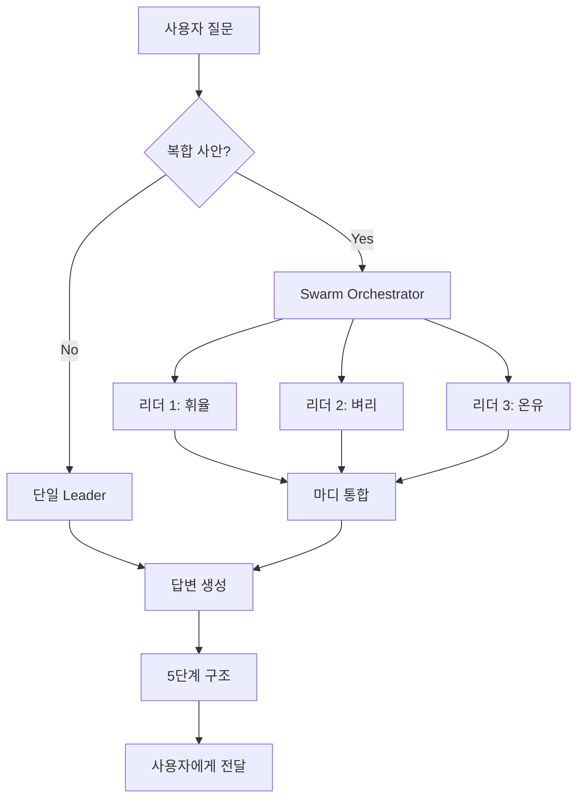

<div align="center">

# ⚖️ Lawmadi OS v60.0.0

### **불안을 행동으로 바꾸는 법률 AI 운영체제**

60명의 전문 법률 리더가 협업하여 복합 법률 사안을 해결합니다

[](https://opensource.org/licenses/MIT)
[](https://www.python.org/downloads/)
[](https://fastapi.tiangolo.com)
[](https://lawmadi-db.web.app)
[](https://github.com/your-repo/lawmadi-os/actions)

[🚀 빠른 시작](#빠른-시작) • [📖 문서](#문서) • [🎯 데모](#데모) • [🤝 기여하기](#기여하기)

</div>

---

## 🌟 핵심 가치

<table>
<tr>
<td width="33%" valign="top">

### 🐝 협업 AI
60명의 전문가가<br/>
복합 사안을 함께 분석

**Swarm 활성화율: 56.8%**

</td>
<td width="33%" valign="top">

### ⚡ 빠른 응답
단일 리더 11초<br/>
Swarm 모드 26초

**평균 응답: 22초**

</td>
<td width="33%" valign="top">

### 🔒 검증된 정확도
법제처 DRF API 기반<br/>
실시간 법령 검증

**테스트 성공률: 100%**

</td>
</tr>
</table>

---

## 📊 실시간 시스템 현황

<div align="center">

### 오늘의 통계 (2026-02-13)

| 지표 | 수치 | 상태 |
|:---:|:---:|:---:|
| **일 방문자** | 56명 | 🟢 |
| **일 질문 수** | 37건 | 🟢 |
| **누적 질문** | 52건 | 📈 |
| **평균 응답** | 22초 | ⚡ |

### 🏆 인기 리더 TOP 3

</div>

```
🥇 무결 (형사법)       ████████████████████ 9건  (11.8초)
🥈 휘율·벼리 (민사법)   █████████████░░░░░░░ 6건  (23.8초)
🥉 누리·담우 (노동법)   ██████████░░░░░░░░░░ 4건  (25.6초)
```

<div align="center">

### 💯 품질 지표

| 기능 | 테스트 | 성공률 | 평가 |
|:---:|:---:|:---:|:---:|
| **법령 검색** | 3/3 | 100% | ✅ |
| **판례 검색** | 2/2 | 100% | ✅ |
| **사건 절차** | 3/3 | 100% | ✅ |
| **전체** | **8/8** | **100%** | 🏆 |

</div>

---

## 🚀 핵심 기능

### 1️⃣ 법령 검색
```bash
📜 "민법 제1조"
→ 법원(法源)의 계층적 구조 설명
→ 법률 > 관습법 > 조리 순서 제시
→ 판례 입장 포함 (1,819자)
⏱️ 10.6초
```

### 2️⃣ 판례 검색
```bash
⚖️ "임대차 보증금 반환 판례"
→ 대법원 판례 다수 인용
→ 동시이행의 원칙 설명
→ Swarm 협업 (온유 + 마디)
⏱️ 27.3초
```

### 3️⃣ 사건 절차 안내
```bash
🔍 "전세금을 안 돌려줘요"
→ 상황정리 + 법률근거 + 행동순서
→ 5단계 구조화된 답변
→ Swarm 협업 (온유 + 찬솔)
⏱️ 29.3초
```

---

## 🏗️ 시스템 아키텍처



### 🔧 기술 스택

<table>
<tr>
<td width="50%">

**Backend**
- 🐍 Python 3.12+
- ⚡ FastAPI 0.128.0
- 🤖 Google Gemini 2.5 Flash
- 📜 법제처 DRF JSON API
- 🗄️ Cloud SQL (PostgreSQL)

</td>
<td width="50%">

**Frontend**
- 🎨 Vanilla HTML/CSS/JS
- 🚀 Firebase Hosting
- 💬 ChatGPT 스타일 UI
- 📱 모바일 최적화

</td>
</tr>
<tr>
<td width="50%">

**Infrastructure**
- ☁️ Google Cloud Run
- 🔄 GitHub Actions CI/CD
- 📊 Cloud Logging
- 🔐 Secret Manager

</td>
<td width="50%">

**AI/ML**
- 🐝 60 Leader Swarm
- 👔 C-Level 임원진
- 🧠 지능형 법령 매칭
- 🔍 자동 도메인 탐지

</td>
</tr>
</table>

---

## 🎯 빠른 시작

### 1. 저장소 클론

```bash
git clone https://github.com/your-repo/lawmadi-os-v50.git
cd lawmadi-os-v50
```

### 2. 환경 설정

```bash
# 가상환경 생성 (선택)
python -m venv venv
source venv/bin/activate  # Windows: venv\Scripts\activate

# 의존성 설치
pip install -r requirements.txt

# 환경변수 설정
cp .env.example .env
nano .env
```

**필수 환경변수**:
```env
# Gemini API
GEMINI_KEY=your_gemini_api_key_here

# 법제처 DRF API (JSON 형식)
LAWGO_DRF_OC=choepeter

# Cloud SQL
DB_USER=postgres
DB_PASS=your_secure_password
DB_NAME=postgres
CLOUD_SQL_INSTANCE=project:region:instance-name

# Optional
SOFT_MODE=true
SWARM_MULTI=true
```

### 3. 서버 실행

```bash
# 개발 모드
python main.py

# 또는 Uvicorn (권장)
uvicorn main:app --host 0.0.0.0 --port 8080 --reload
```

### 4. API 테스트

```bash
# 헬스 체크
curl http://localhost:8080/health

# 법령 검색
curl -X POST http://localhost:8080/ask \
  -H "Content-Type: application/json" \
  -d '{"query": "민법 제1조"}'

# 통계 조회
python quick_stats.py
```

---

## 📖 문서

### 🔒 헌법적 정의 (claude.md)

**Article 1: DRF API 형식은 JSON이다**

```python
# ✅ 올바른 사용
params = {
    "OC": "choepeter",      # 인증키
    "target": "law",         # 검색 대상
    "type": "JSON",          # ⚡ JSON 필수 (XML 아님)
    "query": "민법"
}

response = requests.get(
    "https://www.law.go.kr/DRF/lawSearch.do",
    params=params
)
data = response.json()  # JSON 파싱

# ❌ 절대 금지
params = {"type": "XML"}  # HTML 에러 페이지 반환됨
```

### 6대 절대 원칙

| # | 원칙 | 설명 |
|:-:|:---|:---|
| 1️⃣ | **SSOT_FACT_ONLY** | DRF 실시간 검증 데이터만 사용 |
| 2️⃣ | **ZERO_INFERENCE** | 검증되지 않은 법률 추론 금지 |
| 3️⃣ | **FAIL_CLOSED** | 불확실하면 답변 차단 |
| 4️⃣ | **IDENTITY** | 변호사 사칭 절대 금지 |
| 5️⃣ | **TIMELINE_RULE** | 임의 날짜 생성 금지 |
| 6️⃣ | **SOURCE_TRANSPARENCY** | 법령 인용 시 메타데이터 필수 |

---

## 🗂️ 프로젝트 구조

```
lawmadi-os-v50/
│
├── 📄 main.py                      # FastAPI 커널 (v60.0.0)
├── ⚙️ config.json                  # 시스템 설정 SSOT
├── 👥 leaders.json                 # 60명 리더 레지스트리
├── 📜 claude.md                    # 헌법적 정의 & 개발 가이드
│
├── 🤖 agents/
│   ├── swarm_orchestrator.py      # ⭐ Swarm 협업 엔진
│   ├── clevel_handler.py          # 👔 C-Level 임원 시스템
│   └── swarm_manager.py           # 레거시 Swarm
│
├── 🔌 connectors/
│   ├── drf_client.py              # 📜 DRF JSON API 클라이언트
│   └── db_client_v2.py            # 🗄️ Cloud SQL 연결
│
├── 🛡️ core/
│   ├── security.py                # 🔒 SafetyGuard + 무결성 검증
│   ├── law_selector.py            # 🧠 지능형 법령 매칭
│   └── parser.py                  # 📝 법률 텍스트 파서
│
├── ⚙️ engines/
│   └── temporal_v2.py             # ⏰ 시간축 분석 엔진
│
├── 🔍 services/
│   └── search_service.py          # 🔎 통합 검색 서비스
│
├── 🎨 frontend/
│   └── index.html                 # 🌐 랜딩 페이지 (모바일 최적화)
│
└── 🧪 tests/
    ├── test_3_core_features.py    # ✅ 핵심 기능 통합 테스트
    ├── db_diagnostics.py          # 🔬 DB 진단 도구
    └── quick_stats.py             # 📊 빠른 통계 조회
```

---

## 🧪 테스트

### 자동화 테스트

```bash
# 🎯 핵심 기능 통합 테스트 (법령/판례/절차)
python test_3_core_features.py

# 📊 DB 진단 및 통계
python db_diagnostics.py

# ⚡ 빠른 통계 조회
python quick_stats.py
```

### 최신 테스트 결과

<div align="center">

```
🧪 Lawmadi OS 핵심 기능 통합 테스트
━━━━━━━━━━━━━━━━━━━━━━━━━━━━━━━━━━━━━

📜 테스트 1: 법령 검색        ✅ 3/3 성공
⚖️  테스트 2: 판례 검색        ✅ 2/2 성공
🔍 테스트 3: 사건 절차 안내   ✅ 3/3 성공

━━━━━━━━━━━━━━━━━━━━━━━━━━━━━━━━━━━━━
총 테스트: 8건
성공: 8건 (100%)
실패: 0건

평균 응답 시간: 22.0초
Swarm 활성화율: 100%

🎉 전체 평가: 우수 (80% 이상)
━━━━━━━━━━━━━━━━━━━━━━━━━━━━━━━━━━━━━
```

</div>

---

## 🗄️ 데이터베이스

### 주요 테이블

<table>
<tr>
<td width="50%">

**chat_history** (사용자 로그)
```sql
- id: SERIAL PRIMARY KEY
- user_query: TEXT
- ai_response: TEXT
- leader_code: VARCHAR
- swarm_mode: BOOLEAN
- leaders_used: TEXT
- query_category: VARCHAR
- latency_ms: INTEGER
- created_at: TIMESTAMPTZ
```

</td>
<td width="50%">

**visitor_stats** (방문자)
```sql
- id: SERIAL PRIMARY KEY
- visitor_id: VARCHAR UNIQUE
- first_visit: TIMESTAMPTZ
- last_visit: TIMESTAMPTZ
- visit_count: INTEGER
```

</td>
</tr>
<tr>
<td width="50%">

**daily_visitors** (일별 집계)
```sql
- visit_date: DATE PRIMARY KEY
- unique_visitors: INTEGER
- total_visits: INTEGER
```

</td>
<td width="50%">

**drf_cache** (법령 캐시)
```sql
- cache_key: VARCHAR PRIMARY KEY
- content: JSONB
- signature: VARCHAR
- expires_at: TIMESTAMPTZ
```

</td>
</tr>
</table>

---

## 🚢 배포

### Cloud Run 자동 배포

```bash
# GitHub에 푸시하면 자동 배포
git add .
git commit -m "feat: 새로운 기능 추가"
git push origin main

# GitHub Actions가 자동으로:
# 1. Docker 이미지 빌드
# 2. Artifact Registry에 푸시
# 3. Cloud Run에 배포
```

### 수동 배포

```bash
# 1. Docker 이미지 빌드
docker build -t gcr.io/lawmadi-db/lawmadi-os:v60.0.0 .

# 2. 이미지 푸시
docker push gcr.io/lawmadi-db/lawmadi-os:v60.0.0

# 3. Cloud Run 배포
gcloud run deploy lawmadi-os-v50 \
  --image gcr.io/lawmadi-db/lawmadi-os:v60.0.0 \
  --platform managed \
  --region asia-northeast3 \
  --memory 2Gi \
  --cpu 2 \
  --max-instances 10 \
  --allow-unauthenticated
```

### Firebase Hosting

```bash
# 프론트엔드 배포
firebase deploy --only hosting

# 특정 사이트만 배포
firebase deploy --only hosting:lawmadi-db
```

---

## 📈 모니터링 & 로깅

### API 엔드포인트

| 엔드포인트 | 용도 | 인증 |
|:---|:---|:---:|
| `/health` | 헬스 체크 | ❌ |
| `/ask` | 법률 질문 답변 | ❌ |
| `/metrics` | 시스템 메트릭 | ⚠️ |
| `/diagnostics` | 상세 진단 | ✅ |
| `/api/admin/*` | 관리자 API | ✅ |

### 로그 확인

```bash
# Cloud Run 로그 (실시간)
gcloud run services logs tail lawmadi-os-v50 --region=asia-northeast3

# 최근 100줄
gcloud run services logs read lawmadi-os-v50 \
  --region=asia-northeast3 \
  --limit=100

# DB 통계
python quick_stats.py
```

---

## 🤝 기여하기

기여를 환영합니다! 다음 단계를 따라주세요:

### 1. Fork & Clone

```bash
# 1. 이 저장소를 Fork
# 2. Fork한 저장소 클론
git clone https://github.com/YOUR_USERNAME/lawmadi-os-v50.git
cd lawmadi-os-v50
```

### 2. 브랜치 생성

```bash
# 기능 브랜치 생성
git checkout -b feature/amazing-feature

# 또는 버그 수정
git checkout -b fix/bug-description
```

### 3. 개발 & 테스트

```bash
# 코드 작성
# ...

# 테스트 실행
python test_3_core_features.py

# Lint 체크 (선택)
flake8 .
black .
```

### 4. 커밋 & Push

```bash
# 변경사항 커밋
git add .
git commit -m "feat: Add amazing feature"

# 원격 저장소에 푸시
git push origin feature/amazing-feature
```

### 5. Pull Request

GitHub에서 Pull Request를 생성하세요!

### 📝 기여 가이드라인

- ✅ `claude.md`의 6대 원칙 준수 필수
- ✅ 모든 PR은 테스트 통과 필요
- ✅ `.env` 파일 커밋 절대 금지
- ✅ 커밋 메시지는 [Conventional Commits](https://www.conventionalcommits.org/) 형식 권장
  - `feat:` 새로운 기능
  - `fix:` 버그 수정
  - `docs:` 문서 변경
  - `style:` 코드 스타일 변경
  - `refactor:` 코드 리팩토링
  - `test:` 테스트 추가/수정
  - `chore:` 빌드/설정 변경

---

## 🎯 로드맵

### v60.1.0 (2026 Q2)

- [ ] 🔗 법령 API 연결 강화 (실시간 법령 조회 완벽 구현)
- [ ] 📚 판례 검색 정확도 향상 (대법원 API 통합)
- [ ] ⚡ 스트리밍 응답 재도입 (안정성 보장)
- [ ] 📱 모바일 앱 베타 출시 (iOS/Android)

### v51.0.0 (2026 Q3-Q4)

- [ ] 🧠 AI 리더 성능 개선 (Gemini Pro 통합)
- [ ] 🌍 다국어 지원 (영어, 일본어)
- [ ] 🎤 음성 인터페이스 추가 (STT/TTS)
- [ ] 🏢 엔터프라이즈 플랜 (법무법인/로펌 전용)
- [ ] 📊 고급 분석 대시보드
- [ ] 🔐 SSO/OAuth 로그인

---

## 📄 라이선스

MIT License - 자세한 내용은 [LICENSE](LICENSE) 파일을 참조하세요.

```
MIT License

Copyright (c) 2026 Lawmadi Team

Permission is hereby granted, free of charge, to any person obtaining a copy
of this software and associated documentation files (the "Software"), to deal
in the Software without restriction, including without limitation the rights
to use, copy, modify, merge, publish, distribute, sublicense, and/or sell
copies of the Software, and to permit persons to whom the Software is
furnished to do so, subject to the following conditions:

The above copyright notice and this permission notice shall be included in all
copies or substantial portions of the Software.

THE SOFTWARE IS PROVIDED "AS IS", WITHOUT WARRANTY OF ANY KIND, EXPRESS OR
IMPLIED, INCLUDING BUT NOT LIMITED TO THE WARRANTIES OF MERCHANTABILITY,
FITNESS FOR A PARTICULAR PURPOSE AND NONINFRINGEMENT.
```

---

## 📞 문의 & 지원

<div align="center">

### 연락처

[](https://github.com/your-repo/lawmadi-os/issues)
[](mailto:support@lawmadi.com)
[](https://lawmadi-db.web.app)

### 커뮤니티

💬 [Discussions](https://github.com/your-repo/lawmadi-os/discussions) • 🐛 [Issues](https://github.com/your-repo/lawmadi-os/issues) • 📖 [Wiki](https://github.com/your-repo/lawmadi-os/wiki)

</div>

---

## 🙏 감사의 말

이 프로젝트는 다음 기술들을 사용합니다:

- [FastAPI](https://fastapi.tiangolo.com/) - 현대적인 웹 프레임워크
- [Google Gemini](https://deepmind.google/technologies/gemini/) - 강력한 LLM
- [PostgreSQL](https://www.postgresql.org/) - 안정적인 데이터베이스
- [Google Cloud](https://cloud.google.com/) - 확장 가능한 인프라

그리고 오픈소스 커뮤니티에 감사드립니다! 🎉

---

## ⭐ Star History

<div align="center">

이 프로젝트가 도움이 되셨다면 ⭐️를 눌러주세요!

[](https://star-history.com/#your-repo/lawmadi-os-v50&Date)

</div>

---

<div align="center">

**Made with ❤️ by Lawmadi Team**

**Powered by 60 AI Leaders | Built with FastAPI | Secured by DRF**

*최종 업데이트: 2026-02-13 | v60.0.0*

[⬆️ 맨 위로](#️-lawmadi-os-v6000)

</div>
